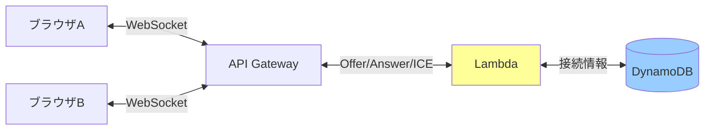
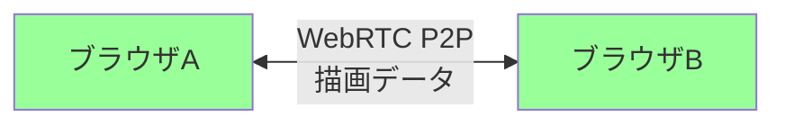

# システムアーキテクチャ

## アーキテクチャ概要

WebRTC P2P通信を使用したリアルタイム共同お絵描きアプリケーション

## 構成（PoC版）

### フロントエンド
- **S3**: 静的ホスティング
  - HTMLファイル、JavaScriptファイル、CSSファイルの配信
  - パブリックアクセス有効化（開発者のみアクセス）
  - CloudFrontは不要（PoC段階のため）

### バックエンド（シグナリングサーバー）
- **API Gateway (WebSocket API)**: シグナリング用
  - WebRTC接続確立時のみ使用
  - Offer/Answer/ICE Candidateの交換

- **Lambda関数**:
  - `onConnect`: WebSocket接続時の処理
  - `onDisconnect`: WebSocket切断時の処理
  - `onSignaling`: シグナリングメッセージの中継

- **DynamoDB**: 接続情報の管理
  - connectionIdの保存
  - ピア情報の一時保存

## データフロー

### 接続確立フロー（Lambdaを使用）

### 描画データフロー（P2P直接通信、Lambda不使用）

**ポイント**: Lambdaを経由せずブラウザ間で直接通信 = 完全無料

## コスト最適化ポイント

### WebRTC P2P方式の利点
- **描画データ送信は完全無料**（ブラウザ間直接通信）
- Lambdaは接続確立時のみ実行（1セッションあたり数回）
- API Gatewayも接続確立時のみ使用

### 想定コスト（開発時）
- Lambda実行: 接続時のみ（1日10回接続 = 月300回）→ **無料枠内**
- API Gateway: シグナリングメッセージのみ（月1000メッセージ未満）→ **無料枠内**
- DynamoDB: 読み書き最小限 → **無料枠内**
- S3: 数MB → **無料枠内**

**結論: ほぼ完全無料で運用可能**

### その他の削減策
- DynamoDBはオンデマンドモード
- Lambda関数のメモリは最小限（128MB）
- 不要時は完全削除（destroy）

## WebRTCの制約

### メリット
- 描画データ送信が完全無料
- 低レイテンシ（直接通信）
- サーバー負荷ゼロ

### デメリット
- 3人以上の接続は複雑（Mesh接続が必要）
- NAT越えに失敗する可能性（STUN/TURNサーバーで解決）
- ブラウザ互換性の考慮が必要

### PoC段階の対応
- 2人での動作確認を優先
- Google Public STUNサーバーを使用（無料）
- TURNサーバーは後で検討

## タグ戦略

全リソースに以下のタグを付与:
- `Project`: `echa25`
- `Environment`: `dev`
- `ManagedBy`: `cdk`
