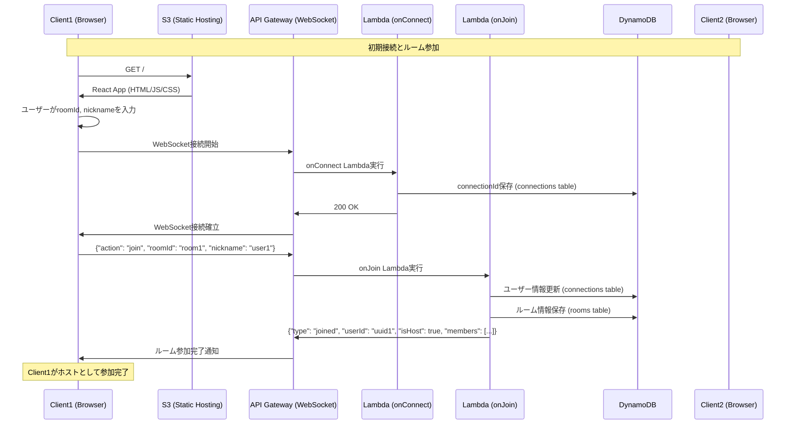
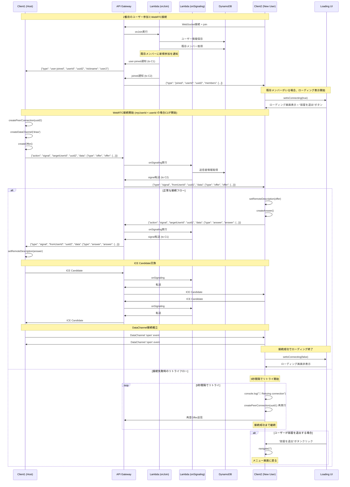
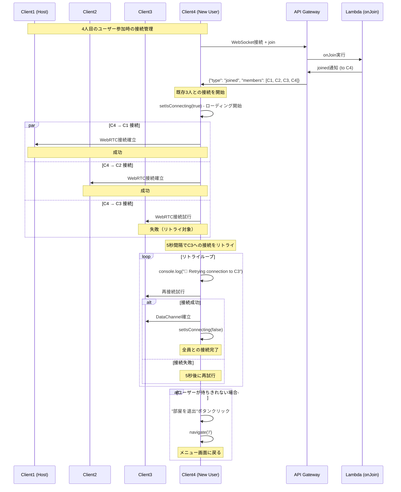
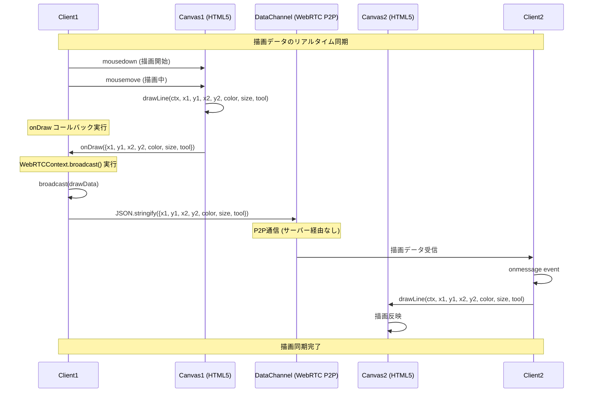
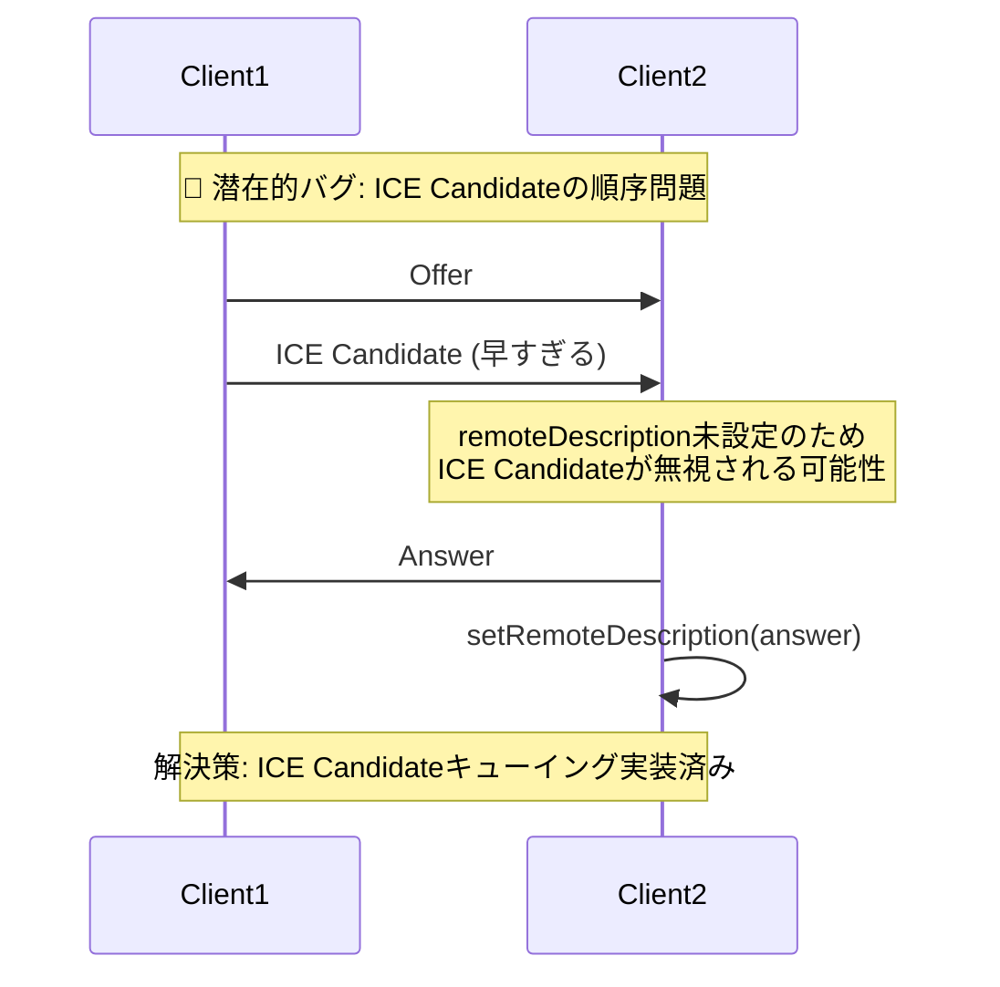
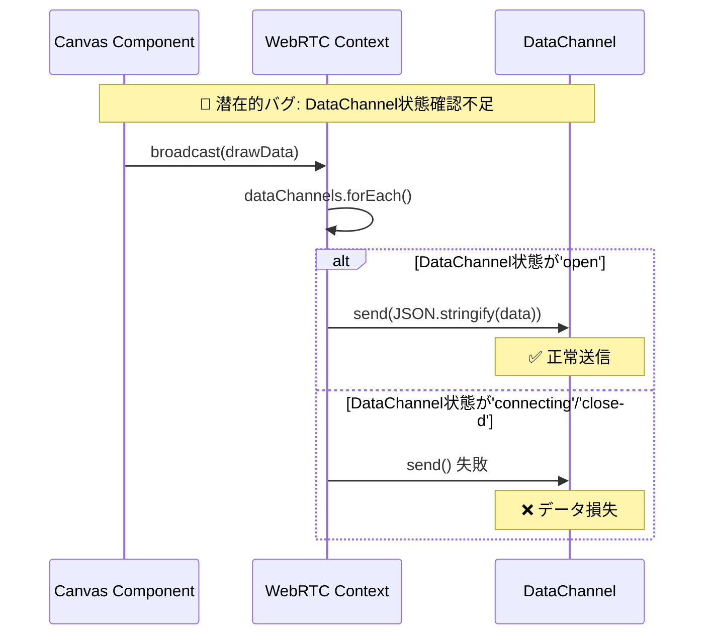
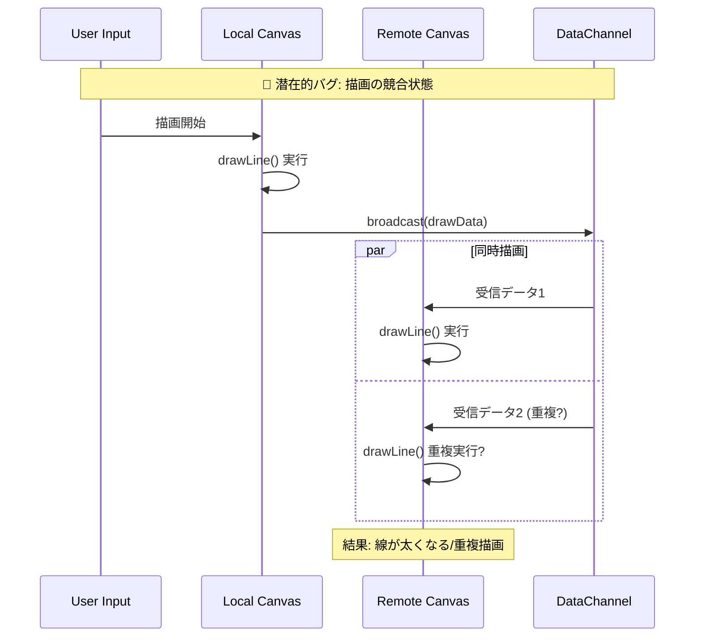

# echa25 システムシーケンス図

WebRTCの同期バグ原因究明のための詳細なシーケンス図

## 1. 初期接続フロー



## 2. 2番目のユーザー参加とWebRTC接続確立（リトライ機能付き）



## 3. 複数人参加時の接続管理



## 4. 描画データ同期フロー



## 5. 潜在的な同期バグのポイント

### 4.1 ICE Candidate タイミング問題



### 4.2 DataChannel状態管理



### 4.3 Canvas描画の競合状態



## 6. デバッグ推奨ポイント

### 5.1 WebRTC接続状態の確認

```javascript
// ブラウザコンソールで実行
console.log('DataChannels:', window.dataChannels)
window.dataChannels.forEach((dc, userId) => {
  console.log(`Peer ${userId}: ${dc.readyState}`)
})
```

### 5.2 描画データフローの追跡

```javascript
// useWebRTC.ts の setupDataChannel 内
dc.onmessage = (event) => {
  const data = JSON.parse(event.data)
  console.log('📥 Received from', userId, ':', data)
  
  // 重複チェック
  if (window.lastDrawData && 
      JSON.stringify(window.lastDrawData) === JSON.stringify(data)) {
    console.warn('🚨 Duplicate draw data detected!')
    return
  }
  window.lastDrawData = data
  
  // 描画処理...
}
```

### 5.3 Canvas状態の確認

```javascript
// Canvas.tsx の onDraw コールバック内
const handleDraw = (data) => {
  console.log('📤 Broadcasting draw:', data)
  
  // 描画データの整合性チェック
  if (data.x1 === data.x2 && data.y1 === data.y2) {
    console.warn('🚨 Zero-length line detected!')
  }
  
  broadcast(data)
}
```

## 7. 修正提案

### 6.1 重複描画防止

```typescript
// WebRTCContext.tsx に追加
const [lastBroadcastData, setLastBroadcastData] = useState<any>(null)

const broadcast = useCallback((message: any) => {
  // 重複チェック
  if (lastBroadcastData && 
      JSON.stringify(lastBroadcastData) === JSON.stringify(message)) {
    console.warn('Duplicate broadcast prevented')
    return
  }
  
  setLastBroadcastData(message)
  // 既存のbroadcast処理...
}, [dataChannels, lastBroadcastData])
```

### 6.2 DataChannel状態の厳密チェック

```typescript
// useWebRTC.ts の broadcast 内
dataChannels.forEach((dc, userId) => {
  if (dc.readyState === 'open') {
    try {
      dc.send(JSON.stringify(message))
    } catch (error) {
      console.error(`Failed to send to ${userId}:`, error)
    }
  } else {
    console.warn(`DataChannel to ${userId} not ready: ${dc.readyState}`)
  }
})
```

### 6.3 描画データの一意性確保

```typescript
// Canvas.tsx に描画ID追加
const [drawId, setDrawId] = useState(0)

const handleDraw = (data) => {
  const drawData = {
    ...data,
    id: drawId,
    timestamp: Date.now()
  }
  setDrawId(prev => prev + 1)
  onDraw(drawData)
}
```

この詳細なシーケンス図により、WebRTCの同期バグの原因を特定し、適切な修正を行うことができます。